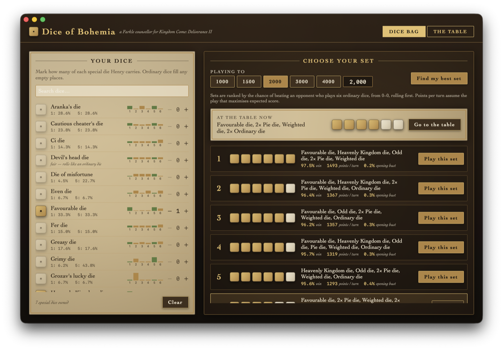
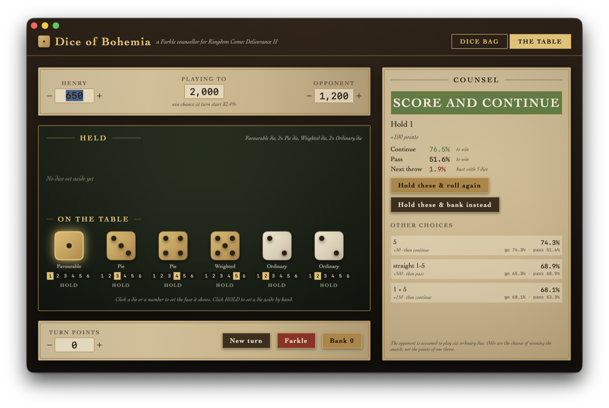

# Dice of Bohemia — a Farkle optimizer for Kingdom Come: Deliverance II

A native macOS app (SwiftUI, Swift Package) that tells you which dice to bring to a
KCD2 dice table and, throw by throw, which dice to hold and whether to **Score and
Continue** or **Score and Pass**.




## What it does

**Dice Bag.** Mark how many of each special die Henry carries (all 40 dice from the game,
with their real face weights). Pick the target score and press *Find my best set*. Every
way of filling six slots from your bag (ordinary dice fill the rest) is scored by expected
points per turn; the best few are then re-ranked by the probability of winning a whole
match against an opponent rolling six ordinary dice.

**The Table.** Enter both scores and the goal, set the face showing on each rolled die,
and the counsel panel highlights the dice to hold and says whether to keep rolling or bank,
with the win probability of each choice, the bust chance of the next throw, and every
other legal hold. *Hold these & roll again* moves the dice aside and adds the points;
*Bank* adds the turn to Henry's score. Hot dice (all six held) are handled.

## How the maths works

- Scoring follows the KCD2 table: 1 = 100, 5 = 50, three of a kind = face × 100 (three 1s
  = 1000), each extra matching die doubles, straights 1–5 / 2–6 / 1–6 = 500 / 750 / 1500.
  No three-pairs rule. A hold must consist only of scoring dice.
- Dice with identical weights are interchangeable, so a turn state is "how many of each
  kind remain" plus the turn total in 50-point units. Every roll outcome of every state is
  enumerated once per set and merged into distinct option sets.
- A backward-induction DP over (turn total, remaining dice) gives the optimal policy for
  any terminal reward. Expected score is used to rank sets and as each player's fixed
  policy when computing the match win-probability table over (my score, opponent score).
- The live recommendation re-solves the current turn with win probability as the reward,
  so it accounts for the score situation (bank when a hold wins, gamble when far behind).

Assumptions: the opponent plays ordinary dice; badges are not modelled; reaching the goal
on a bank wins immediately.

## Build and run

Requires macOS 14+ and Xcode 16 (Swift 5.10 toolchain or newer).

```sh
swift run FarkleOptimizer          # run from source
swift test                         # core logic tests
./scripts/make-app.sh              # produces dist/Farkle Optimizer.app
swift run -c release farkle-bench  # timing harness for the solver
```

`FARKLE_DEMO=1 swift run FarkleOptimizer` starts on the table with a sample position;
`FARKLE_DEMO=bag` starts on the bag with a sample inventory and runs the ranking. Demo
mode does not touch your saved inventory.

You can also open `Package.swift` in Xcode and run the `FarkleOptimizer` scheme.

## Layout

- `Sources/FarkleCore` — rules, dice catalog, turn model, DP solvers, game solver, advisor,
  set optimizer (no UI; tested in `Tests/FarkleCoreTests`).
- `Sources/FarkleOptimizer` — the SwiftUI app.
- `Sources/FarkleBench` — command-line timing harness.
- `docs/superpowers/specs` — design notes.
